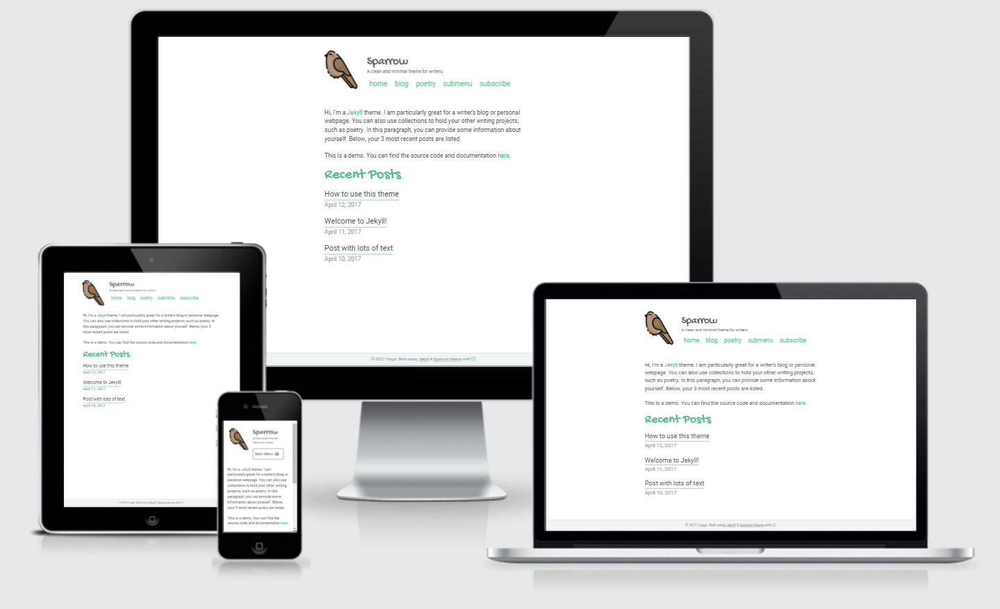

# Sparrow

A clean minimal Jekyll theme for writers. 

[Live Demo](http://theconfused.me/sparrow)

- [Features](#features)
- [Install](#install)
    - [General configuration](#general-configuration)
    - [Disqus](#disqus)
    - [Google analytics](#google-analytics)
    - [Collections](#collections)
    - [Pagination](#pagination)
    - [Front matter defaults](#front-matter-defaults)
- [Credits](#)

## Screenshot 



## Features

- Configurable and responsive multi layer menu, adapted from [slimmenu](https://github.com/adnantopal/slimmenu)
- Disqus integration
- [Font Awesome icons](http://fontawesome.io/) included
- Google analytics
- Social sharing using [Ridiculously Responsive Social Sharing Buttons](https://www.rrssb.ml/)
- 404 page included
- Typographic optimization for Chinese fonts
- Atom feed with jekyll-feed
- Pagination enabled for blog using [Jekyll Paginate](https://github.com/jekyll/jekyll-paginate)
- Basic SEO with Facebook Open Graph tags and Twitter cards

## Install

Just fork this repo and replace the posts with your own. Also rename the sample poetry collection to replace it with your own collection, or just delete it if you don't need to use collections. The example is poetry, but you can easily revamp this into essays, short stories, portfolio, or whatever your creative work is. 

To run your site locally, do `bundle exec jekyll serve`. 

For customization, see below. 

### General configuration

Customize these values in the `_config.yml` file: 

```yaml
title                    : "Sparrow"
title_separator          : "-"
description              : "A clean and minimal theme for writers."
favicon                  : "/assets/images/bird.png"
avatar                   : "/assets/images/bird.png"
url                      : "https://theconfused.me" # the base hostname & protocol for your site e.g. "https://mmistakes.github.io"
baseurl                  : "/sparrow" 

# Site Author
author:
  name                   : "Lingyi" # appears in the footer and atom feed
```


### Disqus

To activate Disqus, fill in your disqus shortname: 

```yaml
comments                 : true # set it to false to disable comments
disqus:
  shortname              : your_shortname
```

### Google analytics

Enable google analytics by filling in your tracking ID: 

```yaml
analytics:
  google:
    tracking_id          : # add your google tracking id here
```

### Collections

If you are using collections, be sure to replace this with your collection name: 

```yaml
collections:
  poetry:
    output: true
    permalink: /:collection/:title/
```

### Pagination

Currently, pagination is set to a the blog page. Unfortunately Jekyll does not yet support pagination on multiple pages. 

If you want to paginate on a different page, simply change the permalink value in the config file and create the relevant page. 

```yaml
paginate: 5 # amount of posts to show
paginate_path: "/blog/page:num/"
timezone: # http://en.wikipedia.org/wiki/List_of_tz_database_time_zones
```

### Front matter defaults

At the bottom of the config file, you can also set [front matter defaults](https://jekyllrb.com/docs/configuration/#front-matter-defaults) so that you don't have to repeat the same front matter for every post. This is an example: 

```yaml
# Front matter defaults
defaults:
  # _pages
  - scope:
      path: ""
      type: pages
    values:
      layout: page
      comments: false
  # _posts
  - scope:
      path: ""
      type: posts
    values:
      layout: post
      comments: true
      share: true
  # _poetry
  - scope:
      path: ""
      type: poetry
    values:
      layout: post
      share: false
```

## Credits

- Bird icon made by [Freepik](http://www.freepik.com) from [Flaticon](http://www.flaticon.com) and is licensed by [CC 3.0 BY](http://creativecommons.org/licenses/by/3.0/)</a></div>
- Photos from [Unsplash](https://unsplash.com/)
