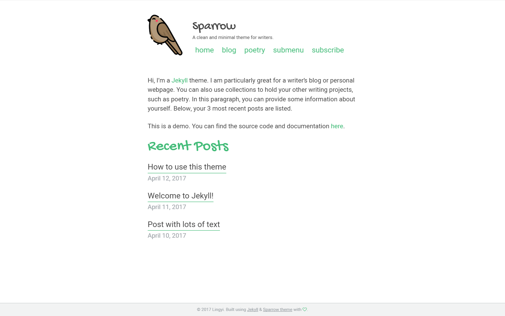

changelog:

0.1.2

- upgraded to jekyll-paginage-v2 and removed the old jekyll-paginate 

# Sparrow

[](https://badge.fury.io/rb/sparrow-jekyll-theme)

A clean minimal Jekyll theme for writers. 

[Live Demo](http://theconfused.me/sparrow)

- [Features](#features)
- [Why the name?](#why-the-name) 
- [Install](#install)
    - [General configuration](#general-configuration)
    - [Disqus](#disqus)
    - [Google analytics](#google-analytics)
    - [Collections](#collections)
    - [Pagination](#pagination)
    - [Navigation](#navigation)
    - [Front matter defaults](#front-matter-defaults)
    - [Other](#other)
- [Credits](#credits)

## Screenshot 



## Features

- Fully compatible with Github Pages
- Configurable and responsive multi layer menu, adapted from [slimmenu](https://github.com/adnantopal/slimmenu)
- Disqus integration
- [Font Awesome icons](http://fontawesome.io/) included
- Google analytics
- Social sharing using [rrssb](https://www.rrssb.ml/)
- 404 page included
- Typographic optimization for Chinese fonts
- Atom feed generated with [jekyll-feed](https://github.com/jekyll/jekyll-feed)
- Pagination enabled for blog using [jekyll-paginate-v2](https://github.com/sverrirs/jekyll-paginate-v2)
- Basic SEO with Facebook Open Graph tags and Twitter cards

## Why the name? 

In Chinese there's a saying that goes 麻雀虽小，五脏俱全。It roughly translates to: small though a sparrow is, it possesses all internal organs. Small but complete is what this theme aspires to be. Minimal but includes all the essential aspects to building a blog. 

## Install

Just fork this repo and replace the posts with your own. Also rename the sample poetry collection to replace it with your own collection, or just delete it if you don't need to use collections. The example is poetry, but you can easily revamp this into essays, short stories, portfolio, or whatever your creative work is. 

OR you can also install this theme as a theme gem. To do that, add to your Gemfile: 

```ruby
gem "sparrow-jekyll-theme"
```

And add this line site's `_config.yml`: 

```yaml
theme: sparrow-jekyll-theme
```

And then do `bundle install`. 

To run your site locally, do `bundle exec jekyll serve`. 

For customization, see below. 

### General configuration

Customize these values in the `_config.yml` file: 

```yaml
title                    : "Sparrow"
title_separator          : "-"
description              : "A clean and minimal theme for writers."
favicon                  : "/assets/images/bird.png"
avatar                   : "/assets/images/bird.png"
url                      : "https://theconfused.me" # the base hostname & protocol for your site e.g. "https://mmistakes.github.io"
baseurl                  : "/sparrow" 

# Site Author
author:
  name                   : "Lingyi" # appears in the footer and atom feed
```


### Disqus

To activate Disqus, fill in your disqus shortname: 

```yaml
comments                 : true # set it to false to disable comments
disqus:
  shortname              : your_shortname
```

### Google analytics

Enable google analytics by filling in your tracking ID: 

```yaml
analytics:
  google:
    tracking_id          : # add your google tracking id here
```

### Collections

If you are using collections, be sure to replace this with your collection name: 

```yaml
collections:
  poetry:
    output: true
    permalink: /:collection/:title/
```

### Pagination

Pagination is done using jekyll-paginate-v2. Currently it is only turned on for the blog page, but it could possibly support pagination on multiple pages. Please read the [jekyll-paginate-v2 documentation](https://github.com/sverrirs/jekyll-paginate-v2/blob/master/README-GENERATOR.md#creating-pagination-trails) for configuraiton. 

### Navigation

You can change the navigation links in `_data/navigation.yml`.

### Front matter defaults

At the bottom of the config file, you can also set [front matter defaults](https://jekyllrb.com/docs/configuration/#front-matter-defaults) so that you don't have to repeat the same front matter for every post. This is an example: 

```yaml
# Front matter defaults
defaults:
  # _pages
  - scope:
      path: ""
      type: pages
    values:
      layout: page
      comments: false
  # _posts
  - scope:
      path: ""
      type: posts
    values:
      layout: post
      comments: true
      share: true
  # _poetry
  - scope:
      path: ""
      type: poetry
    values:
      layout: post
      share: false
```

### Other

To enhance SEO, you can add your twitter username to `_config.yml`. 

You can also add a image path for the `og_image` value in the config file, for a default open graph sharing image. This value can be overridden in individual posts. 

For the various config options see the [sample config file for the demo site](https://github.com/lingxz/sparrow/blob/master/_config.yml)

There are also helper classes for ease of inserting image and their captions, adapted from the [Minimal Mistakes theme by Michael Rose](https://github.com/mmistakes/minimal-mistakes). You can find a [sample post with images](https://theconfused.me/sparrow/blog/post-with-image/) on the [demo site](https://theconfused.me/sparrow). 

The color schemes and fonts can also be customized through scss, by editing the relevant variable in `_variables.scss`. 

## Credits

- Bird icon made by [Freepik](http://www.freepik.com) from [Flaticon](http://www.flaticon.com) and is licensed by [CC 3.0 BY](http://creativecommons.org/licenses/by/3.0/).
- Photos from [Unsplash](https://unsplash.com/)
